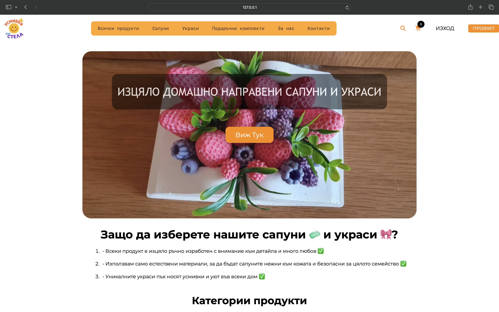
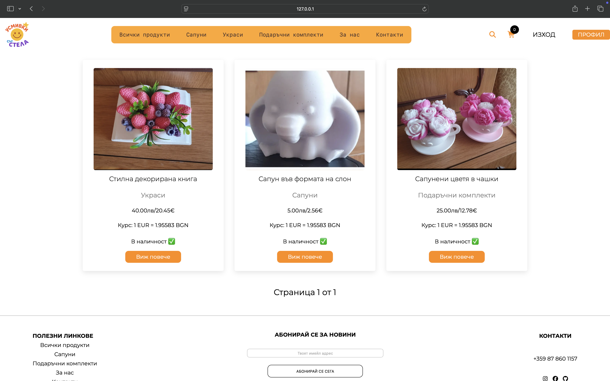

# 🌸 Smiles With Stela (Усмивки със Стела)

Smiles With Stela е уеб приложение, създадено с много любов и внимание към детайла като личен подарък за моята майка.  
Проектът представя свят на ръчно изработени продукти, декоративни елементи и артистично оформени сапуни, насочен към хора, които ценят естетиката, индивидуалността и ръчния труд.

Този проект има както **емоционална стойност**, така и **практическа цел** – да послужи като реален пример за цялостно Django уеб приложение.

---

## 🖼️ Screenshots

  
  
  
  
  

---

## 📌 Основна идея на проекта

Smiles With Stela е създаден с цел:
- Да представи ръчно изработени продукти в естетичен уеб формат
- Да служи като подарък и личен проект
- Да демонстрира умения в Django, Python и web development
- Да бъде стабилна основа за бъдещо разширяване

---

## ⚙️ Използвани технологии

### Backend
- Python 3
- Django
- Django ORM
- MVT архитектура

### Frontend
- HTML5
- CSS3
- JavaScript

---

## 🧩 Архитектура

- Основно приложение: mother_gift
- 9 под-апликации за различни страници
- MVT модел

---

## ▶️ Стартиране локално


Нека да ви кажа как да стартирате проекта локално.

### 1.Клонирайте репозиторито
```terminal
git clone https://github.com/RosenCodes20/Smiles-With-Stela
```

### 2.Отворете проекта

### 3.Създайте венв папка (Ако не е създадена)

``` terminal
python -m venv venv
```

### 4.Инсталирайте необходимите ресурси
```terminal
pip install -r requirements.txt
```


### 5.Настройте базата в settings.py файла (Информацията трябва да бъде скрита)

### 6. Задвижете миграциите

``` terminal

python manage.py migrate

```

### 7.И накрая просто ръннете проекта
``` terminal

python manage.py runserver

```

---

## ❤️ Благодарности

Проектът е създаден с много любов като подарък за моята майка.

---

## 👤 Автор

RosenCodes20 (Росен Иванов)
https://github.com/RosenCodes20
